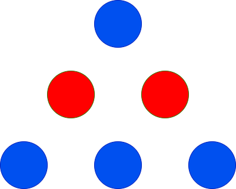
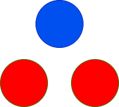

# 三角形的最大高度

给你两个整数 `red` 和 `blue`，分别表示红色球和蓝色球的数量。你需要使用这些球来组成一个三角形，满足第 1 行有 1 个球，第 2 行有 2 个球，第 3 行有 3 个球，依此类推。

每一行的球必须是 **相同** 颜色，且相邻行的颜色必须 **不同**。

返回可以实现的三角形的 **最大** 高度。

## 示例 1：
>### 输入：
>red = 2, blue = 4
>### 输出：
>3
>### 解释：
>

## 示例 2：
>### 输入：
>red = 2, blue = 1
>### 输出：
>2
>### 解释：
>

## 代码：
1.

    public class Solution {
        public int MaxHeightOfTriangle(int red, int blue) {
            return Math.Max(GetMaxHeight(new int[]{red, blue}), GetMaxHeight(new int[]{blue, red}));
        }

        public int GetMaxHeight(int[] counts) {
            int height = 0;
            int position = 0;
            while (height + 1 <= counts[position]) {
                height++;
                counts[position] -= height;
                position ^= 1;
            }
            return height;
        }
    }
2.

    public class Solution {
        public int MaxHeightOfTriangle(int red, int blue) {
            int num_0=0;
            int num_1=0;
            int R=red;
            int B=blue;
            for(int i=1;i<=red+blue;i++){
                if(blue>=i){
                    blue-=i;
                    num_0++;
                    i++;
                }
                else{
                    break;
                }
                if(red>=i){
                    red-=i;
                    num_0++;
                }
                else{
                    break;
                }
            } 

            for(int i=1;i<=R+B;i++){
                if(R>=i){
                    R-=i;
                    num_1++;
                    i++;
                }
                else{
                    break;
                }
                if(B>=i){
                    B-=i;
                    num_1++;
                }
                else{
                    break;
                }            
            } 
            return Math.Max(num_0,num_1);       
        }
    }
3.

    public class Solution {
        public int MaxHeightOfTriangle(int red, int blue) {
            // 尝试从红色球开始
            int maxHeightFromRed = CalculateMaxHeight(red, blue, true);
            // 尝试从蓝色球开始
            int maxHeightFromBlue = CalculateMaxHeight(red, blue, false);
            
            // 返回两者中的最大值
            return Math.Max(maxHeightFromRed, maxHeightFromBlue);
        }

        private int CalculateMaxHeight(int red, int blue, bool startWithRed) {
            int height = 0;
            int currentColor = startWithRed ? 0 : 1; // 0 for red, 1 for blue

            while (true) {
                height++;
                if (currentColor == 0) { // Red row
                    if (red >= height) {
                        red -= height;
                        currentColor = 1; // Next row should be blue
                    } else {
                        break; // Not enough red balls for the next row
                    }
                } else { // Blue row
                    if (blue >= height) {
                        blue -= height;
                        currentColor = 0; // Next row should be red
                    } else {
                        break; // Not enough blue balls for the next row
                    }
                }
            }

            return height - 1; // Return the last successfully completed height
        }
    }

